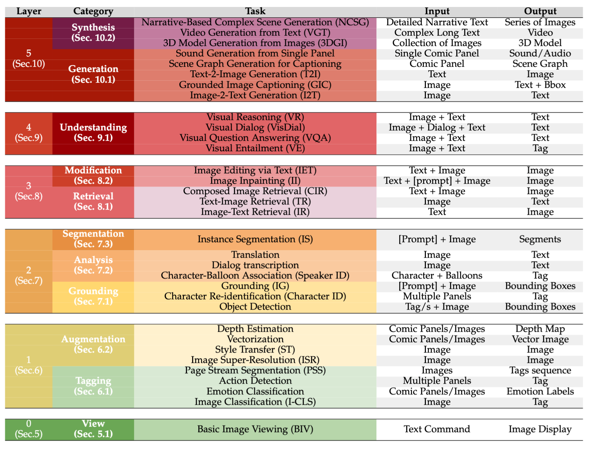

# Comics Understanding 

This repository contains a curated list of research papers and resources focusing on Comics Understanding.

🔥🔥 [*A missing piece in Vision and Language: A Survey on Comics Understanding*](http://arxiv.org/abs/2409.xxxxx) 🔥🔥
\
\
**Authors:** 
[**Emanuele Vivoli**](https://scholar.google.com/citations?user=BCzPjawAAAAJ),
[**Andrey Barsky**](https://scholar.google.com/citations?hl=en&user=wWYzhSEAAAAJ),
[**Mohamed Ali Souibgui**](https://scholar.google.com/citations?user=LXq3YYMAAAAJ),
[**Marco Bertini**](https://scholar.google.com/citations?user=SBm9ZpYAAAAJ),
[**Dimosthenis Karatzas**](https://scholar.google.com/citations?user=xASEtrUAAAAJ)

## 📣 Latest News 📣
- 🚧 This repo is a work in progress, please [contribute here](#how-to-contribute-)
- **`beginning of September 2024`** Our survey paper will dropped to **arxiv**!!

# 📚 Table of Contents

Overview of Vision-Language Tasks of the Layers of Comics Understanding. The ranking is based on input and output modalities and dimensions, as illustrated in the paper

    

