# Awesome **Comics Understanding** 

This repository contains a curated list of research papers and resources focusing on Comics Understanding.

###  
### 🔥 [*One missing piece in Vision and Language: A Survey on Comics Understanding*](https://arxiv.org/abs/2409.09502) 🔥
**Authors:**
[**Emanuele Vivoli**](https://scholar.google.com/citations?user=BCzPjawAAAAJ),
[**Andrey Barsky**](https://scholar.google.com/citations?hl=en&user=wWYzhSEAAAAJ),
[**Mohamed Ali Souibgui**](https://scholar.google.com/citations?user=LXq3YYMAAAAJ),
[**Artemis Llabrés**](https://scholar.google.com/citations?user=0VToXYcAAAAJ),
[**Marco Bertini**](https://scholar.google.com/citations?user=SBm9ZpYAAAAJ),
[**Dimosthenis Karatzas**](https://scholar.google.com/citations?user=xASEtrUAAAAJ)

## 📣 Latest News 📣
- 🚧 This repo is a work in progress, please [contribute here](#how-to-contribute-)
- **`14 September 2024`** Our survey paper have dropped in [arXiv](https://arxiv.org/abs/2409.09502) !!

# 📚 Table of Contents

Overview of Vision-Language Tasks of the Layers of Comics Understanding. The ranking is based on input and output modalities and dimensions, as illustrated in the paper.

    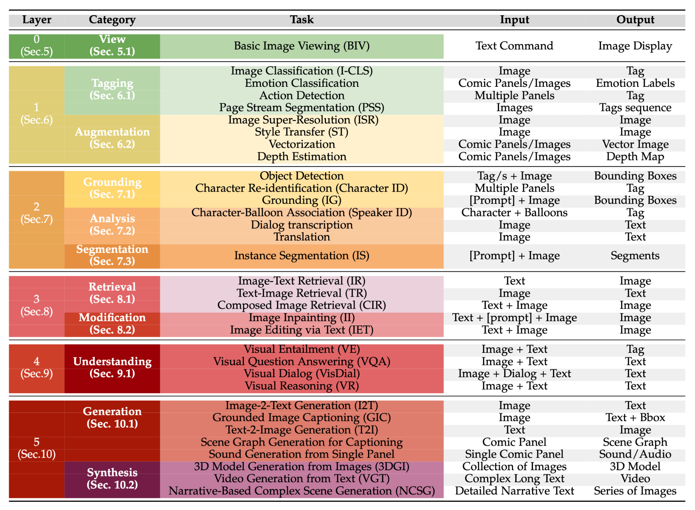

## Layers of Comics Understanding

Every survey worthy of the name includes illustrative visuals to enhance understanding. We've followed this approach by providing examples for each task in the Layer of Comics Understanding.\
Go check every Layer's tasks image ⬇️.

### **Layer 1: Tagging and Augmentation**
    
- #### Tagging
    

        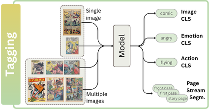
    

  - 

      
Image classification

      
      | **Year** | **Conference / Journal** | **Title** | **Authors** | **Links** |
      |:--------:|:--------------:|:----------------------------------------------------|:---------------------|:---------:|
      |   2023   |      TIP      | Panel-Page-Aware Comic Genre Understanding | *Xu, Chenshu et al.* | [📜 Paper](https://ieeexplore.ieee.org/document/10112648) |
      |   2019   |      ICDAR Workshop      | Analysis Based on Distributed Representations of Various Parts Images in Four-Scene Comics Story Dataset | *Terauchi, Akira et al.* | [📜 Paper](https://ieeexplore.ieee.org/document/8892946) |
      |   2018   |      TPAMI      | Learning Consensus Representation for Weak Style Classification | *Jiang, Shuhui et al.* |  [📜 Paper](https://pubmed.ncbi.nlm.nih.gov/29990099/) |
      |   2018   |      ICDAR      | Comic Story Analysis Based on Genre Classification | *Daiku, Yuki et al.* | [📜 Paper](https://ieeexplore.ieee.org/abstract/document/8270238) |
      |   2017   |      ICDAR      | Histogram of Exclamation Marks and Its Application for Comics Analysis | *Hiroe, Sotaro et al.* | [📜 Paper](http://ieeexplore.ieee.org/document/8270239/) |
      |   2014   |      ACM Multimedia      | Line-Based Drawing Style Description for Manga Classification | *Chu, Wei-Ta et al.* | [📜 Paper](https://dl.acm.org/doi/abs/10.1145/2647868.2654962) |
  

  - 

      
Emotion classification

      
      | **Year** | **Conference / Journal** | **Title** | **Authors** | **Links** |
      |:--------:|:--------------:|:----------------------------------------------------|:---------------------|:---------:|
      |   2023   |      MMM      | Manga Text Detection with Manga-Specific Data Augmentation and Its Applications on Emotion Analysis | *Yang, Yi-Ting et al.* | [📜 Paper](https://link.springer.com/chapter/10.1007/978-3-031-27818-1_3) |
      |   2021   |     ICDAR      | Competition on Multimodal Emotion Recognition on Comics Scenes | *Nguyen, Nhu-Van et al.* | [📜 Paper](https://dl.acm.org/doi/10.1007/978-3-030-86337-1_51), [👨‍💻 Code](https://github.com/shwetkm/Multimodal-Emotion-Recognition-on-Comics-scenes-EmoRecCom) |
      |   2016   |      MANPU (ICPR)     | Manga Content Analysis Using Physiological Signals | *Sanches, Charles Lima et al.* | [📜 Paper](https://dl.acm.org/doi/10.1145/3011549.3011555) |
      |   2015   |      IIAI-AAI      | Relation Analysis between Speech Balloon Shapes and Their Serif Descriptions in Comic | *Tanaka, Hideki et al.* | [📜 Paper](https://ieeexplore.ieee.org/document/7373906) |
  

  - 

      
Action Detection

      
      | **Year** | **Conference / Journal** | **Title** | **Authors** | **Links** |
      |:--------:|:--------------:|:----------------------------------------------------|:---------------------|:---------:|
      | 2024 | Arxiv | MangaUB: A Manga Understanding Benchmark for Large Multimodal Models | Ikuta, Hikaru et al. | [📜 Paper](https://arxiv.org/abs/2407.19034) |
      |   2024   |      MANPU (ICDAR)    | ComicBERT: A Transformer Model and Pre-training Strategy for Contextual Understanding in Comics | *Soykan, Gurkan et al.* | [📜 Paper](https://api.semanticscholar.org/CorpusID:272694691), [👨‍💻 Code](https://github.com/gsoykan/comicbert) |
      |   2024   |      ICDAR      | Multimodal Transformer for Comics Text-Cloze | *Vivoli, Emanuele et al.* | [📜 Paper](http://arxiv.org/abs/2403.03719) |
      |   2020   |      Arxiv      | A Comprehensive Study of Deep Video Action Recognition | *Zhu, Yi et al.* | [📜 Paper](http://arxiv.org/abs/2012.06567), [👨‍💻 Code](https://cv.gluon.ai/model_zoo/action_recognition.html) |
      |   2017   |      CVPR      | The Amazing Mysteries of the Gutter: Drawing Inferences Between Panels in Comic Book Narratives | *Iyyer, Mohit et al.* | [📜 Paper](https://arxiv.org/abs/1611.05118) |
  

  - 

      
Page Stream Segmentation

      
      | **Year** | **Conference / Journal** | **Title** | **Authors** | **Links** |
      |:--------:|:--------------:|:----------------------------------------------------|:---------------------|:---------:|
      |   2022   |      ICPR      | Semantic Parsing of Interpage Relations | *Demirtaş, Mehmet Arif et al.* | [📜 Paper](https://ieeexplore.ieee.org/document/9956546) |
      |   2018   |      LREC      | Page Stream Segmentation with Convolutional Neural Nets Combining Textual and Visual Features | *Wiedemann, Gregor et al.* | [📜 Paper](https://aclanthology.org/L18-1581) |
      |   2013   |      ICDAR      | Document Classification and Page Stream Segmentation for Digital Mailroom Applications | *Gordo, Albert et al.* | [📜 Paper](http://ieeexplore.ieee.org/document/6628693/) |
  

- #### Augmentation ( Image-2-Image )
    

        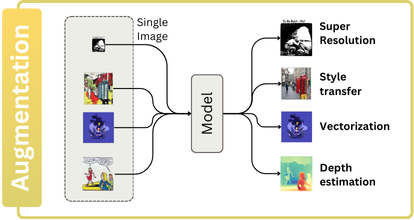
    

  - 

      
Image Super-Resolution

      
      | **Year** | **Conference / Journal** | **Title** | **Authors** | **Links** |
      |:--------:|:--------------:|:----------------------------------------------------|:---------------------|:---------:|
      |   2023   |      MTA      | Automatic Dewarping of Camera-Captured Comic Document Images | *Garai, Arpan et al.* | [📜 Paper](https://link.springer.com/10.1007/s11042-022-13234-y) |
  

  - 

      
Style Transfer

      
      | **Year** | **Conference / Journal** | **Title** | **Authors** | **Links** |
      |:--------:|:--------------:|:----------------------------------------------------|:---------------------|:---------:|
      |   2023  |      Arxiv      | Inkn'hue: Enhancing Manga Colorization from Multiple Priors with Alignment Multi-Encoder VAE | *Jiramahapokee, Tawin* | [📜 Paper](https://arxiv.org/abs/2311.01804), [👨‍💻 Code](https://github.com/wootwootwootwoot/inknhue) |
      |   2023  |      IEEE Access      | Robust Manga Page Colorization via Coloring Latent Space | *Golyadkin, Maksim et al.* | [📜 Paper](https://ieeexplore.ieee.org/document/10278137) |
      |   2023   |      TVCG      | Shading-Guided Manga Screening from Reference | *Wu, Huisi et al.* | [📜 Paper](https://ieeexplore.ieee.org/document/10143242) |
      |   2022   |      Arxiv      | DASS-Detector: Domain-Adaptive Self-Supervised Pre-Training for Face \& Body Detection in Drawings | *Topal, Barış Batuhan et al.* | [📜 Paper](http://arxiv.org/abs/2211.10641), [👨‍💻 Code](https://github.com/barisbatuhan/DASS_Detector) |
      |   2021  |      CVPR      | Generating Manga from Illustrations via Mimicking Manga Creation Workflow | Zhang, LM et al.* | [📜 Paper](https://ieeexplore.ieee.org/document/9577891), [👨‍💻 Code](https://github.com/lllyasviel/MangaFilter) |
      |   2021   |      CVPR      | Unbiased Mean Teacher for Cross-domain Object Detection | *Deng, Jinhong et al.* | [📜 Paper](https://arxiv.org/abs/2003.00707), [👨‍💻 Code](https://github.com/kinredon/umt) |
      |   2021   |      CVPR      | Encoding in Style: A StyleGAN Encoder for Image-to-Image Translation | *Richardson, Elad et al.* | [📜 Paper](http://arxiv.org/abs/2008.00951), [👨‍💻 Code](https://github.com/eladrich/pixel2style2pixel) |
      |   2021   |     AAAI       | MangaGAN: Unpaired Photo-to-Manga Translation Based on The Methodology of Manga Drawing | *Su, Hao et al.* | [📜 Paper](https://arxiv.org/pdf/2004.10634.pdf) |
      |  2019   |      ISM      | Synthesis of Screentone Patterns of Manga Characters | *Tsubota, K. et al.* | [📜 Paper](https://ieeexplore.ieee.org/document/8959008), [👨‍💻 Code](https://github.com/kktsubota/manga-character-screentone) |
      |   2018  |      SciVis      | Color Interpolation for Non-Euclidean Color Spaces | *Zeyen, Max et al.* | [📜 Paper](https://ieeexplore.ieee.org/document/8823597) |
      |   2017   |      ACM-SIGGRAPH Asia      | Comicolorization: Semi-automatic Manga Colorization | *Furusawa, Chie et al.* | [📜 Paper](https://dl.acm.org/doi/10.1145/3145749.3149430), [👨‍💻 Code](https://github.com/DwangoMediaVillage/Comicolorization) |
      |   2017   |      ICDAR      | CGAN-Based Manga Colorization Using a Single Training Image | *Hensman, Paulina et al.* | [📜 Paper](https://ieeexplore.ieee.org/document/8270240/), [👨‍💻 Code](https://github.com/ryanliwag/cGan-Based-Manga-Colorization-using-1-training-image)|
      |   2017   |      CVPR      | Image-to-Image Translation with Conditional Adversarial Networks | *Isola, Phillip et al.* | [📜 Paper](http://arxiv.org/abs/1611.07004) |
      |   2017   |      ACM-TG      | Deep Extraction of Manga Structural Lines | *Li, Chengze et al.* | [📜 Paper](https://dl.acm.org/doi/10.1145/3072959.3073675), [👨‍💻 Code](https://github.com/ljsabc/MangaLineExtraction_PyTorch) |
  

  - 

      
Vectorization

      
      | **Year** | **Conference / Journal** | **Title** | **Authors** | **Links** |
      |:--------:|:--------------:|:----------------------------------------------------|:---------------------|:---------:|
      |   2023   |      TCSVT      | MARVEL: Raster Gray-level Manga Vectorization via Primitive-wise Deep Reinforcement Learning | *H. Su et al.* | [📜 Paper](https://ieeexplore.ieee.org/document/10233891), [👨‍💻 Code](https://github.com/SwordHolderSH/Mang2Vec) |
      |   2022   |      CVPR      | Towards Layer-wise Image Vectorization | *Ma, Xu et al.* | [📜 Paper](https://arxiv.org/abs/2206.04655), [👨‍💻 Code](https://github.com/ma-xu/LIVE) |
      |   2017   |      ACM-TG      | Deep Extraction of Manga Structural Lines | *Li, Chengze et al.* | [📜 Paper](https://dl.acm.org/doi/10.1145/3072959.3073675), [👨‍💻 Code](https://github.com/ljsabc/MangaLineExtraction_PyTorch) |
      |   2017  |     TVCG      | Manga Vectorization and Manipulation with Procedural Simple Screentone | *Yao, Chih-Yuan et al.* | [📜 Paper](https://ieeexplore.ieee.org/document/7399427) |
      |   2011   |      ACM-SIGGRAPH      | Depixelizing Pixel Art | *Kopf, Johannes et al.* | [📜 Paper](https://doi.org/10.1145/1964921.1964994) |
      |   2003   |      N/A      | Potrace : A Polygon-Based Tracing Algorithm | *Selinger, Peter* | [📜 Paper](https://www.semanticscholar.org/paper/Potrace-%3A-a-polygon-based-tracing-algorithm-Selinger/e60b78c1fed3fa907411bb189767e868e4a421f8), [👨‍💻 Code](https://potrace.sourceforge.net) |
  

  - 

      
Depth Estimation

      
      | **Year** | **Conference / Journal** | **Title** | **Authors** | **Links** |
      |:--------:|:--------------:|:----------------------------------------------------|:---------------------|:---------:|
      |   2023   |      CVPR Workshop      | Dense Multitask Learning to Reconfigure Comics | *Bhattacharjee, Deblina et al.* | [📜 Paper](https://arxiv.org/abs/2307.08071) |
      |   2022   |      WACV    | Estimating Image Depth in the Comics Domain | *Bhattacharjee, Deblina et al.* | [📜 Paper](https://arxiv.org/abs/2110.03575),  [👨‍💻 Code](https://github.com/IVRL/ComicsDepth) |
      |   2022  |      CVPR      | MulT: An End-to-End Multitask Learning Transformer | *Bhattacharjee, Deblina et al.* | [📜 Paper](http://arxiv.org/abs/2205.08303), [👨‍💻 Code](https://github.com/IVRL/MulT) |
  

### **Layer 2: Grounding, Analysis and Segmentation**
    
- #### Grounding
    

        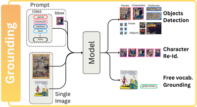
    

    - 

        
Object detection

        | **Year** | **Conference / Journal** | **Title** | **Authors** | **Links** |
        |:--------:|:--------------:|:----------------------------------------------------|:---------------------|:---------:|
        |   2024   |      MANPU (ICDAR)    | Comics Datasets Framework: Mix of Comics datasets for detection benchmarking | *Vivoli, Emanuele et al.* | [📜 Paper](https://arxiv.org/abs/2407.03540) |
        |   2024   |      MANPU (ICDAR)    | A Comprehensive Gold Standard and Benchmark for Comics Text Detection and Recognition | *Gurkan Soykan et al.* | [📜 Paper](https://arxiv.org/abs/2212.14674), [👨‍💻 Code](https://github.com/gurkansoykan/comic-text-detection-benchmark) |
        |   2023   |      MMM      | Manga Text Detection with Manga-Specific Data Augmentation and Its Applications on Emotion Analysis | *Yang, \relax YT et al.* | [📜 Paper](https://dl.acm.org/doi/10.1007/978-3-031-27818-1_3) |
        |   2023   |   CSNT      | CPD: Faster RCNN-based DragonBall Comic Panel Detection | *Sharma, Rishabh et al.* | [📜 Paper](https://ieeexplore.ieee.org/document/10134577) |
        |   2022   |      IJDAR      | BCBId: First Bangla Comic Dataset and Its Applications | *Dutta, Arpita et al.* | [📜 Paper](https://doi.org/10.1007/s10032-022-00412-9) |
        |   2022   |      ECCV      | COO/ Comic Onomatopoeia Dataset for Recognizing Arbitrary or Truncated Texts | *Baek, Jeonghun et al.* | [📜 Paper](http://arxiv.org/abs/2207.04675), [👨‍💻 Code](https://github.com/ku21fan/COO-Comic-Onomatopoeia) |
        |   2019   |      ICDAR Workshop      | What Do We Expect from Comic Panel Extraction? | *Nguyen Nhu, Van et al.* | [📜 Paper](https://ieeexplore.ieee.org/document/8893103) |
        |   2019   |      ICDAR Workshop      | CNN Based Extraction of Panels/Characters from Bengali Comic Book Page Images | *Dutta, Arpita et al.* | [📜 Paper](https://ieeexplore.ieee.org/document/8893046/) |
        |   2018   |      VCIP      | Text Detection in Manga by Deep Region Proposal, Classification, and Regression | *Chu, Wei-Ta et al.* | [📜 Paper](https://ieeexplore.ieee.org/document/8698677) |
        |   2018   |      IWAIT     | A Study on Object Detection Method from Manga Images Using CNN | *Yanagisawa, Hideaki et al.* | [📜 Paper](https://ieeexplore.ieee.org/document/8369633/) |
        |   2018   |     IWAIT      | A Study on Object Detection Method from Manga Images Using CNN | *Yanagisawa, Hideaki et al.* | [📜 Paper](https://ieeexplore.ieee.org/document/8369633/) |
        |   2017   |      ICDAR      | A Faster R-CNN Based Method for Comic Characters Face Detection | *Qin, Xiaoran et al.* | [📜 Paper](https://ieeexplore.ieee.org/document/8270109) |
        |   2016   |      IJCG      | Text-Aware Balloon Extraction from Manga | *Liu, Xueting et al.* | [📜 Paper](https://dl.acm.org/doi/10.1007/s00371-015-1084-0) |
        |   2016   |      IJCNN      | Line-Wise Text Identification in Comic Books: A Support Vector Machine-Based Approach | *Pal, Srikanta et al.* | [📜 Paper](https://ieeexplore.ieee.org/document/7727719) |
        |   2016   |      ICIP      | Text Detection in Manga by Combining Connected-Component-Based and Region-Based Classifications | *Aramaki, Yuji et al.* | [📜 Paper](http://ieeexplore.ieee.org/document/7532890) |
        |   2015   |      ICIAP      | Panel Tracking for the Extraction and the Classification of Speech Balloons | *Jomaa, Hadi S. et al.* | [📜 Paper](https://dl.acm.org/doi/10.1007/978-3-319-23234-8_37) |
        |   2012   |      DAS      | Panel and Speech Balloon Extraction from Comic Books | *Ho, Anh Khoi Ngo et al.* | [📜 Paper](https://ieeexplore.ieee.org/document/6195407) |
        |   2011   |      IJI      | Method for Real Time Text Extraction of Digital Manga Comic | *Arai, Kohei et al.* | [📜 Paper](https://api.semanticscholar.org/CorpusID:59874189) |
        |   2011   |      ICDAR      | Recognizing Text Elements for SVG Comic Compression and Its Novel Applications | *Su, Chung-Yuan et al.* | [📜 Paper](https://ieeexplore.ieee.org/document/6065526) |
        |  2010   |      ICIT      | Method for Automatic E-Comic Scene Frame Extraction for Reading Comic on Mobile Devices | *Arai, Kohei et al.* | [📜 Paper](https://ieeexplore.ieee.org/document/5501698) |
        |  2009   |      IJHCI      | Enhancing the Accessibility for All of Digital Comic Books | *Ponsard, Christophe* | [📜 Paper](https://api.semanticscholar.org/CorpusID:707176) |
    

    
    - 

        
Character Re-Identification

        

        | **Year** | **Conference / Journal** | **Title** | **Authors** | **Links** |
        |:--------:|:--------------:|:----------------------------------------------------|:---------------------|:---------:|
        |   2024   |      Arxiv      | Tails Tell Tales: Chapter-Wide Manga Transcriptions with Character Names | *Ragav Sachdeva et al.* | [📜 Paper](https://arxiv.org/abs/2408.00298), [👨‍💻 Code](https://github.com/ragavsachdeva/magi) |
        |   2024   |      NeurIPS      | CoMix: A Comprehensive Benchmark for Multi-Task Comic Understanding | *Emanuele Vivoli et al.* | [📜 Paper](https://arxiv.org/abs/2407.03550), [👨‍💻 Code](https://github.com/emanuelevivoli/CoMix) |
        |   2024   |      CVPR      | The Manga Whisperer: Automatically Generating Transcriptions for Comics | *Sachdeva, Ragav et al.* | [📜 Paper](http://arxiv.org/abs/2401.10224), [👨‍💻 Code](https://github.com/ragavsachdeva/magi) |
        |   2023   |      IET Image Processing      | Toward Cross-Domain Object Detection in Artwork Images Using Improved YoloV5 and XGBoosting | *Ahmad, Tasweer et al.* | [📜 Paper](https://api.semanticscholar.org/CorpusID:258159957) |
        |   2023   |      Arxiv      | Identity-Aware Semi-Supervised Learning for Comic Character Re-Identification | *Soykan, Gürkan et al.* | [📜 Paper](https://arxiv.org/abs/2308.09096) |
        |   2023   |      ACM-MM Asia      | Occlusion-Aware Manga Character Re-Identification with Self-Paced Contrastive Learning | *Zhang, Ci-Yin et al.* | [📜 Paper](https://dl.acm.org/doi/10.1145/3595916.3626401) |
        |   2022   |      Arxiv      | Unsupervised Manga Character Re-Identification via Face-Body and Spatial-Temporal Associated Clustering | *Zhang, Z et al.* | [📜 Paper](https://arxiv.org/abs/2204.04621) |
        |   2022   |      ICIR      | CAST: Character Labeling in Animation Using Self‐supervision by Tracking | *Nir, Oron et al.* | [📜 Paper](https://onlinelibrary.wiley.com/doi/10.1111/cgf.14464) |
        |   2020   |      ICPR      | Dual Loss for Manga Character Recognition with Imbalanced Training Data | *Li, Yonggang et al.* | [📜 Paper](https://ieeexplore.ieee.org/abstract/document/9412282) |
        |   2020   |      ICML      | A Simple Framework for Contrastive Learning of Visual Representations | *Chen, Ting et al.* | [📜 Paper](http://arxiv.org/abs/2002.05709) |
        |   2015   |      ACPR      | Similarity Learning Based on Pool-Based Active Learning for Manga Character Retrieval | *Iwata, Motoi et al.* | [📜 Paper](https://ieeexplore.ieee.org/document/7486541) |
        |   2014   |      DAS      | A Study to Achieve Manga Character Retrieval Method for Manga Images | *Iwata, M. et al.* |  [📜 Paper](https://ieeexplore.ieee.org/document/6831019) |
        |   2012   |      CVPR      | Color Attributes for Object Detection | *Khan, Fahad Shahbaz et al.* | [📜 Paper](https://ieeexplore.ieee.org/document/6248068) |
        |   2012   |      ECCV      | PHOG Analysis of Self-Similarity in Aesthetic Images | *Redies, Christoph et al.* | [📜 Paper](https://link.springer.com/chapter/10.1007/978-3-642-33863-2_54) |
        |   2011   |      ICDAR      | Similar Manga Retrieval Using Visual Vocabulary Based on Regions of Interest | *Sun, Weihan et al.* | [📜 Paper](https://ieeexplore.ieee.org/document/6065475) |
    

    
    - 

        
Sentence-based Grounding

        

        | **Year** | **Conference / Journal** | **Title** | **Authors** | **Links** |
        |:--------:|:--------------:|:----------------------------------------------------|:---------------------|:---------:|
        |   2024   |  AAAI | GroundVLP: Harnessing Zero-shot Visual Grounding from Vision-Language Pre-training and Open-Vocabulary Object Detection | *Shen, Haozhan et al.* | [📜 Paper](http://arxiv.org/abs/2312.15043), [👨‍💻 Code](https://github.com/om-ai-lab/GroundVLP) |
        |   2024   |  ECCV | Grounding DINO: Marrying DINO with Grounded Pre-Training for Open-Set Object Detection | *Liu, Shilong et al.* | [📜 Paper](http://arxiv.org/abs/2303.05499), [👨‍💻 Code](https://github.com/IDEA-Research/GroundingDINO) |
        |   2020   |  CVPR Workshop | Exploring Phrase Grounding without Training: Contextualisation and Extension to Text-Based Image Retrieval | *Parcalabescu, Letitia et al.* | [📜 Paper](https://ieeexplore.ieee.org/document/9150575/) |
        |   2019   |  AAAI | Zero-Shot Object Detection with Textual Descriptions | *Li, Zhihui et al.* | [📜 Paper](https://ojs.aaai.org/index.php/AAAI/article/view/4891) |
    

    
-  #### Analysis
    

        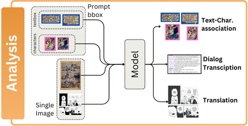
    

    - 

        
Text-Character association

        

        | **Year** | **Conference / Journal** | **Title** | **Authors** | **Links** |
        |:--------:|:--------------:|:----------------------------------------------------|:---------------------|:---------:|
        |   2024   |      Arxiv      | Tails Tell Tales: Chapter-Wide Manga Transcriptions with Character Names | *Ragav Sachdeva et al.* | [📜 Paper](https://arxiv.org/abs/2408.00298), [👨‍💻 Code](https://github.com/ragavsachdeva/magi) |
        |   2024   |      NeurIPS      | CoMix: A Comprehensive Benchmark for Multi-Task Comic Understanding | *Emanuele Vivoli et al.* | [📜 Paper](https://arxiv.org/abs/2407.03550), [👨‍💻 Code](https://github.com/emanuelevivoli/CoMix) |
        |   2024   |      MANPU (ICDAR)    | Spatially Augmented Speech Bubble to Character Association via Comic Multi-task Learning | *Soykan, Gurkan et al.* | [📜 Paper](https://api.semanticscholar.org/CorpusID:272694702) [💻 Code](https://github.com/gsoykan/spatially_augmented_comic_mtl) |
        |   2024   |      CVPR      | The Manga Whisperer: Automatically Generating Transcriptions for Comics | *Sachdeva, Ragav et al.* | [📜 Paper](http://arxiv.org/abs/2401.10224), [👨‍💻 Code](https://github.com/ragavsachdeva/magi) |
        |   2023   |      arXiv      | Manga109Dialog A Large-scale Dialogue Dataset for Comics Speaker Detection | *Li, Yingxuan et al.* | [📜 Paper](http://arxiv.org/abs/2306.17469) |
        |   2022   |      IIAI-AAI   | Algorithms for Estimation of Comic Speakers Considering Reading Order of Frames and Texts | *Omori, Yuga et al.* | [📜 Paper](https://ieeexplore.ieee.org/document/9894649/) |
        |   2019   |      IJDAR      | Comic MTL: Optimized Multi-Task Learning for Comic Book Image Analysis | *Nguyen, Nhu-Van et al.* | [📜 Paper](https://dl.acm.org/doi/10.1007/s10032-019-00330-3) |
        |   2015   |      ICDAR      | Speech Balloon and Speaker Association for Comics and Manga Understanding | *Rigaud, Christophe et al.* | [📜 Paper](http://ieeexplore.ieee.org/document/7333782/) |
    

    
    - 

        
Panel Sorting

        

        | **Year** | **Conference / Journal** | **Title** | **Authors** | **Links** |
        |:--------:|:--------------:|:----------------------------------------------------|:---------------------|:---------:|
        |   2017   |      ICDAR     | Story Pattern Analysis Based on Scene Order Information in Four-Scene Comics | *Ueno, Miki et al.* | [📜 Paper](https://ieeexplore.ieee.org/document/8270241) |
    

    - 

        
Dialog transcription

        

        | **Year** | **Conference / Journal** | **Title** | **Authors** | **Links** |
        |:--------:|:--------------:|:----------------------------------------------------|:---------------------|:---------:|
        |   2024   |      Arxiv      | Tails Tell Tales: Chapter-Wide Manga Transcriptions with Character Names | *Ragav Sachdeva et al.* | [📜 Paper](https://arxiv.org/abs/2408.00298), [👨‍💻 Code](https://github.com/ragavsachdeva/magi) |
        |   2024   |      NeurIPS      | CoMix: A Comprehensive Benchmark for Multi-Task Comic Understanding | *Emanuele Vivoli et al.* | [📜 Paper](https://arxiv.org/abs/2407.03550), [👨‍💻 Code](https://github.com/emanuelevivoli/CoMix) |
        |   2024   |      CVPR      | The Manga Whisperer: Automatically Generating Transcriptions for Comics | *Sachdeva, Ragav et al.* | [📜 Paper](http://arxiv.org/abs/2401.10224), [👨‍💻 Code](https://github.com/ragavsachdeva/magi) |
        |   2023   |      arXiv      | Manga109Dialog A Large-scale Dialogue Dataset for Comics Speaker Detection | *Li, Yingxuan et al.* | [📜 Paper](http://arxiv.org/abs/2306.17469) |
    

    
    - 

        
Translation

        

        | **Year** | **Conference / Journal** | **Title** | **Authors** | **Links** |
        |:--------:|:--------------:|:----------------------------------------------------|:---------------------|:---------:|
        |   2024   |  ArXiv | Context-Informed Machine Translation of Manga using Multimodal Large Language Models | *Lippmann, Philip et al.* | [📜 Paper](https://arxiv.org/abs/2411.02589), [👨‍💻 Code](https://github.com/plippmann/multimodal-manga-translation) |
        |   2024   |  ArXiv | Large Language Models as Manga Translators: A Case Study | *Zhishen Yang et al.* | [paper](https://www.arxiv.org/abs/2405.05226) |
        |   2024   |  ArXiv | Generating Visual Stories with Grounded and Coreferent Characters | *Danyang Liu et al.* | [paper](https://www.arxiv.org/abs/2409.13555) |
        |   2024   |  ICKECS | The Future of Graphic Novel Translation: Fully Automated Systems | *Sandeep Singh et al.* | [paper](https://api.semanticscholar.org/CorpusID:271747919) |
        |   2024   |  ACM Multimedia | Zero-Shot Character Identification and Speaker Prediction in Comics via Iterative Multimodal Fusion | *Yingxuan Li et al.* | [paper](https://api.semanticscholar.org/CorpusID:272770579) |
        |   2023   |  ArXiv | Multi-Teacher Knowledge Distillation For Text Image Machine Translation | *Cong Ma et al.* | [paper](https://www.arxiv.org/abs/2305.05226) |
        |   2020   |  ArXiv | Towards Fully Automated Manga Translation | *Ryota Hinami et al.* | [paper](https://www.arxiv.org/abs/2012.14271) |
        |   2014   |  inTRAlinea | Visual adaptation in translated comics | *Federico, Zanettin* | [paper](https://www.intralinea.org/archive/article/2079) |
        
    

-  #### Segmentation
    

        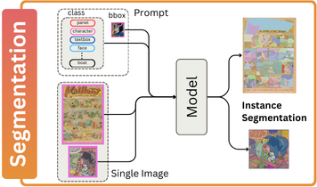
    

    - 

        
Instance Segmentation

        

        | **Year** | **Conference / Journal** | **Title** | **Authors** | **Links** |
        |:--------:|:--------------:|:----------------------------------------------------|:---------------------|:---------:|
        |   2024   |      AI4VA (ECCV)     | Unlocking Comics: The AI4VA Dataset for Visual Understanding | *Grönquist, Peter et al.* | [📜 Paper](https://arxiv.org/abs/2410.20459),[👨‍💻 Code](https://github.com/IVRL/AI4VA) |
        |   2024   |      ICDAR      | Investigating Neural Networks and Transformer Models for Enhanced Comic Decoding | *Kouletou, Eleanna et al.* | [📜 Paper](https://arxiv.org/abs/2401.05953) |
        |   2022   |      DataverseNL     | The Visual Language Research Corpus (VLRC) Project | *Cohn, Neil* | [📜 Paper](https://doi.org/10.34894/LWMZ7G) |
    

### **Layer 3: Retrieval and Modification**

- #### Retrieval
    

        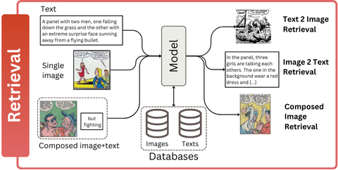
    

    - 

        
Image-Text Retrieval

        

        | **Year** | **Conference / Journal** | **Title** | **Authors** | **Links** |
        |:--------:|:--------------:|:----------------------------------------------------|:---------------------|:---------:|
        |   2014   |      DAS      | A Study to Achieve Manga Character Retrieval Method for Manga Images | *Iwata, M. et al.* |  [📜 Paper](https://ieeexplore.ieee.org/document/6831019) |
        |   2011   |      ICDAR      | Similar Manga Retrieval Using Visual Vocabulary Based on Regions of Interest | *Sun, Weihan et al.* | [📜 Paper](https://ieeexplore.ieee.org/document/6065475) |
        |   2011   |      CAVW      | Comic Character Animation Using Bayesian Estimation | *Chou, Yun-Feng et al.* | [📜 Paper](https://nycu-staging.elsevierpure.com/en/publications/comic-character-animation-using-bayesian-estimation) |
        |   2010   |      ICGC      | Searching Digital Political Cartoons | *Wu, Yejun* | [📜 Paper](https://www.researchgate.net/publication/221414603_Searching_Digital_Political_Cartoons) |
    

    
    - 

        
Text-Image Retrieval

        

        | **Year** | **Conference / Journal** | **Title** | **Authors** | **Links** |
        |:--------:|:--------------:|:----------------------------------------------------|:---------------------|:---------:|
        |   2014   |      ICIP      | Sketch2Manga: Sketch-based Manga Retrieval | *Matsui, Yusuke et al.* | [📜 Paper](https://ieeexplore.ieee.org/document/7025626) |
    

    
    - 

        
Composed Image Retrieval

        

        | **Year** | **Conference / Journal** | **Title** | **Authors** | **Links** |
        |:--------:|:--------------:|:----------------------------------------------------|:---------------------|:---------:|
        |   2023   |      Arxiv      | MaRU: A Manga Retrieval and Understanding System Connecting Vision and Language | *Shen, Conghao Tom et al.* | [📜 Paper](https://arxiv.org/abs/2311.02083) |
        |   2022   |      DICTA      | ComicLib: A New Large-Scale Comic Dataset for Sketch Understanding | *Wei, Xin et al.* | [📜 Paper](https://ieeexplore.ieee.org/abstract/document/10034579/) |
        |   2021   |      ICDAR      | Manga-MMTL: Multimodal Multitask Transfer Learning for Manga Character Analysis | *Nguyen, Nhu-Van et al.* | [📜 Paper](https://dl.acm.org/doi/10.1007/978-3-030-86331-9_27) |
        |   2017   |      ICDAR      | Sketch-Based Manga Retrieval Using Deep Features | *Narita, Rei et al.* | [📜 Paper](https://ieeexplore.ieee.org/abstract/document/8270236) |
        |   2017   |      Arxiv      | A Neural Representation of Sketch Drawings | *Ha, David et al.* | [📜 Paper](http://arxiv.org/abs/1704.03477) |
        |   2017   |      Arxiv      | Style Transfer for Anime Sketches with Enhanced Residual U-net and Auxiliary Classifier GAN | *Zhang, Lvmin et al.* | [📜 Paper](http://arxiv.org/abs/1706.03319) |
        |   2015   |      MM-TA      | Sketch-Based Manga Retrieval Using Manga109 Dataset | *Matsui, Yusuke et al.* | [📜 Paper](https://arxiv.org/abs/1510.04389) |
    

    
    - 

        
Personalized Image Retrieval

        
        | **Year** | **Conference / Journal** | **Title** | **Authors** | **Links** |
        |:--------:|:--------------:|:----------------------------------------------------|:---------------------|:---------:|
        |   2022   |      BMVC      | Personalised CLIP or: How to Find Your Vacation Videos | *Korbar, Bruno et al.* | [📜 Paper](https://bmvc2022.mpi-inf.mpg.de/639) |

    

- #### Modification
    

        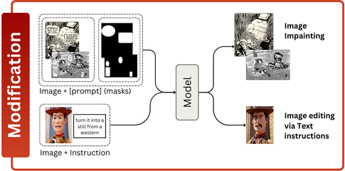
    

    - 

        
Image Impainting and Editing

        

        | **Year** | **Conference / Journal** | **Title** | **Authors** | **Links** |
        |:--------:|:--------------:|:----------------------------------------------------|:---------------------|:---------:|
        |   2022   |      ACM-UIST      | CodeToon: Story Ideation, Auto Comic Generation, and Structure Mapping for Code-Driven Storytelling | *Suh, Sangho et al.* | [📜 Paper](http://arxiv.org/abs/2208.12981) |
        |   2022   |      TVCG      | Interactive Data Comics | *Wang, Zezhong et al.* | [📜 Paper](https://ieeexplore.ieee.org/document/9552591/) |
    

### **Layer 4: Understanding**

-   #### Understanding
    

        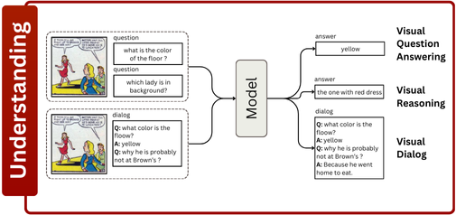
    

    - 

        
Visual Entailment

        

        | **Year** | **Conference / Journal** | **Title** | **Authors** | **Links** |
        |:--------:|:--------------:|:----------------------------------------------------|:---------------------|:---------:|
    

    
    - 

        
Visual-Question Answer

        

        | **Year** | **Conference / Journal** | **Title** | **Authors** | **Links** |
        |:--------:|:--------------:|:----------------------------------------------------|:---------------------|:---------:|
        |   2022   |      WACV      | Challenges in Procedural Multimodal Machine Comprehension: A Novel Way To Benchmark | *Sahu, Pritish et al.* | [📜 Paper](https://arxiv.org/abs/2110.11899) |
        |   2021  |     Arxiv      | Towards Solving Multimodal Comprehension | *Sahu, Pritish et al.* | [📜 Paper](https://api.semanticscholar.org/CorpusID:233307454) |
        |   2020   |      MDPI-AS      | A Survey on Machine Reading Comprehension—Tasks, Evaluation Metrics and Benchmark Datasets | *Zeng, Changchang et al.* | [📜 Paper](https://www.mdpi.com/2076-3417/10/21/7640) |
        |   2017   |      IIWAS      | ComicQA: Contextual Navigation Aid by Hyper-Comic Representation | *Sumi, Yasuyuki et al.* | [📜 Paper](https://dl.acm.org/doi/10.1145/3151759.3151790) |
        |   2016   |      MANPU (ICPR)    | Designing a Question-Answering System for Comic Contents | *Moriyama, Yukihiro et al.* | [📜 Paper](https://doi.org/10.1145/3011549.3011554) |
    

    - 

        
Visual-Dialog

        

        | **Year** | **Conference / Journal** | **Title** | **Authors** | **Links** |
        |:--------:|:--------------:|:----------------------------------------------------|:---------------------|:---------:|
        
    

    - 

        
Visual Reasoning

        

        | **Year** | **Conference / Journal** | **Title** | **Authors** | **Links** |
        |:--------:|:--------------:|:----------------------------------------------------|:---------------------|:---------:|

    

### **Layer 5: Generation and Synthesis**

-   #### Generation
    

        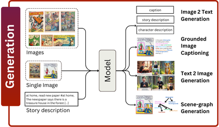
    

    - 

        
Comics generation from other media

        

        | **Year** | **Conference / Journal** | **Title** | **Authors** | **Links** |
        |:--------:|:--------------:|:----------------------------------------------------|:---------------------|:---------:|
        |   2023   |      SIGCSE      | Developing Comic-based Learning Toolkits for Teaching Computing to Elementary School Learners | *Castro, Francico et al.* | [📜 Paper](https://dl.acm.org/doi/abs/10.1145/3545947.3576272) |
        |   2022  |      THMS      | Augmenting Conversations With Comic-Style Word Balloons | *Zhang, H. et al.* | [📜 Paper](https://ieeexplore.ieee.org/abstract/document/9969440) |
        |   2022  |      LACLO      | Comics as a Pedagogical Tool for Teaching | *Lima, Antonio Alexandre et al.* | [📜 Paper](https://api.semanticscholar.org/CorpusID:256034564) |
        |   2021   |      TVCG      | ChartStory: Automated Partitioning, Layout, and Captioning of Charts into Comic-Style Narratives | *Zhao, Jian et al.* | [📜 Paper](https://ieeexplore.ieee.org/document/9547737) |
        |   2021  |      SIGCSE      | Using Comics to Introduce and Reinforce Programming Concepts in CS1 | *Suh, Sangho et al.* | [📜 Paper](https://dl.acm.org/doi/abs/10.1145/3408877.3432465) |
        |   2021   |      MM-CCA      | Automatic Comic Generation with Stylistic Multi-page Layouts and Emotion-driven Text Balloon Generation | *Yang, Xin et al.* | [📜 Paper](http://arxiv.org/abs/2101.11111) |
        |   2018   |      ACM      | Comixify: Transform Video into a Comics | *Pesko, Maciej et al.* | [📜 Paper](http://arxiv.org/abs/1812.03473) |
        |   2015   |      TOMM      | Content-Aware Video2Comics With Manga-Style Layout | *Jing, Guangmei et al.* | [📜 Paper](http://ieeexplore.ieee.org/document/7226841/) |
        |   2012   |      TOMM      | Movie2Comics: Towards a Lively Video Content Presentation | *Wang, Meng et al.* | [📜 Paper](https://ieeexplore.ieee.org/document/6148281) |
        |   2012   |      ACM-TG      | Automatic Stylistic Manga Layout | *Cao, Ying et al.* | [📜 Paper](https://dl.acm.org/doi/10.1145/2366145.2366160) |
        |   2012   |      TOMM      | Scalable Comic-like Video Summaries and Layout Disturbance | *Herranz, Luis et al.* | [📜 Paper](http://ieeexplore.ieee.org/document/6177266/) |
        |   2011   |      ACM-MM      | Automatic Preview Generation of Comic Episodes for Digitized Comic Search | *Hoashi, Keiichiro et al.* | [📜 Paper](https://dl.acm.org/doi/abs/10.1145/2072298.2072047) |
        |   2011   |      ISPACS      | Automatic Comic Strip Generation Using Extracted Keyframes from Cartoon Animation | *Tanapichet, Pakpoom et al.* | [📜 Paper](https://ieeexplore.ieee.org/document/6146180) |
        |   2011   |      ICMLC      | Caricaturation for Human Face Pictures | *Chang, I-Cheng et al.* | [📜 Paper](https://ieeexplore.ieee.org/document/6017011) |
        |   2010   |      SICE      | Comic Live Chat Communication Tool Based on Concept of Downgrading | *Matsuda, Misaki et al.* | [📜 Paper](https://ieeexplore.ieee.org/abstract/document/5602541/) |
        |   2010   |     CAIDCD      | Research and Development of the Generation in Japanese Manga Based on Frontal Face Image | *Xuexiong, Deng et al.* | [📜 Paper](https://colab.ws/articles/10.1109%2Fcaidcd.2010.5681245) |
    

    - 

        
Comics to Scene graph

        | **Year** | **Conference / Journal** | **Title** | **Authors** | **Links** |
        |:--------:|:--------------:|:----------------------------------------------------|:---------------------|:---------:|

    

    - 

        
Image-2-Text Generation

        

        | **Year** | **Conference / Journal** | **Title** | **Authors** | **Links** |
        |:--------:|:--------------:|:----------------------------------------------------|:---------------------|:---------:|
        |   2024   | NeurIPS | Cracking the Code of Juxtaposition: Can AI Models Understand the Humorous Contradictions | *Hu, Zhe et al.* | [📜 Paper](https://arxiv.org/pdf/2405.19088) |
        |   2024   |      AI4VA (ECCV)      | ComiCap: A VLMs pipeline for dense captioning of Comic Panels | *Vivoli, Emanuele et al.* | [📜 Paper](https://arxiv.org/abs/2409.16159) |
        |   2024   |  ICDAR | Multimodal Transformer for Comics Text-Cloze | *Vivoli, Emanuele et al.* | [📜 Paper](http://arxiv.org/abs/2403.03719) |
        |   2024   |      MANPU (ICDAR)      | Toward Accessible Comics for Blind and Low Vision Readers | *Rigaud, Christophe et al.* | [📜 Paper](https://arxiv.org/abs/2407.08248) |
        |   2024   |      CVPR      | The Manga Whisperer: Automatically Generating Transcriptions for Comics | *Sachdeva, Ragav et al.* | [📜 Paper](http://arxiv.org/abs/2401.10224), [👨‍💻 Code](https://github.com/ragavsachdeva/magi) |
        |   2023   |      Arxiv      | Comics for Everyone: Generating Accessible Text Descriptions for Comic Strips | *Ramaprasad, Reshma et al.* | [📜 Paper](https://arxiv.org/abs/2310.00698) |
        |   2023   |      ACL      | Multimodal Persona Based Generation of Comic Dialogs | *Agrawal, Harsh et al.* | [📜 Paper](https://aclanthology.org/2023.acl-long.791) |
        |   2023   |      Arxiv      | M2C: Towards Automatic Multimodal Manga Complement | *Guo, Hongcheng et al.* | [📜 Paper](https://arxiv.org/abs/2310.17130) |

    

    - 

        
Text-2-Image Generation

        

        | **Year** | **Conference / Journal** | **Title** | **Authors** | **Links** |
        |:--------:|:--------------:|:----------------------------------------------------|:---------------------|:---------:|
        |   2023   |      ICCV      | Diffusion in Style | *Everaert, Martin Nicolas et al.* | [📜 Paper](https://ieeexplore.ieee.org/document/10377661), [👨‍💻 Code]() |
        |   2023   |      MDPI-AS      | A Study on Generating Webtoons Using Multilingual Text-to-Image Models | *Yu, Kyungho et al.* | [📜 Paper](https://www.mdpi.com/2076-3417/13/12/7278) |
        |   2023   |      Arxiv      | Generating Coherent Comic with Rich Story Using ChatGPT and Stable Diffusion | *Jin, Ze et al.* | [📜 Paper](https://arxiv.org/abs/2305.11067) |
        |   2022   |      ISM      | Conditional GAN for Small Datasets | *Hiruta, Komei et al.* | [📜 Paper](https://ieeexplore.ieee.org/document/10019704) |
        |   2021   |      NAACL      | Improving Generation and Evaluation of Visual Stories via Semantic Consistency | *Maharana, Adyasha et al.* | [📜 Paper](http://arxiv.org/abs/2105.10026), [👨‍💻 Code](https://github.com/adymaharana/StoryViz) |
        |   2021   |      CoRR      | Integrating Visuospatial, Linguistic and Commonsense Structure intoStory Visualization | *Maharana, Adyasha et al.* | [📜 Paper](https://arxiv.org/abs/2110.10834), [👨‍💻 Code](https://github.com/adymaharana/VLCStoryGan) |
        |   2021   |      ICCC      | A Deep Learning Pipeline for the Synthesis of Graphic Novels | *Melistas, Thomas et al.* | [📜 Paper](https://doi.org/10.5281/zenodo.11120828) |
        |   2021   |      Arxiv      | ComicGAN: Text-to-Comic Generative Adversarial Network | *Proven-Bessel, Ben et al.* | [📜 Paper](http://arxiv.org/abs/2109.09120), [👨‍💻 Code](https://github.com/nijuyr/comixGAN) |
        |   2019   |      CVPR      | StoryGAN: A Sequential Conditional GAN for Story Visualization | *Li, Yitong et al.* | [📜 Paper](http://arxiv.org/abs/1812.02784), [👨‍💻 Code](https://github.com/yitong91/StoryGAN) |
        |   2018   |      CVPR      | Cross-Domain Weakly-Supervised Object Detection through Progressive Domain Adaptation | *Inoue, Naoto et al.* | [📜 Paper](http://arxiv.org/abs/1803.11365), [👨‍💻 Code](https://github.com/naoto0804/cross-domain-detection) |
        |   2017   |      Arxiv      | Towards the Automatic Anime Characters Creation with Generative Adversarial Networks | *Jin, Yanghua et al.* | [📜 Paper](http://arxiv.org/abs/1708.05509), [👨‍💻 Code](https://github.com/ctwxdd/Tensorflow-ACGAN-Anime-Generation) |
    

    
    - 

        
Scene-graph Generation for captioning

        

        | **Year** | **Conference / Journal** | **Title** | **Authors** | **Links** |
        |:--------:|:--------------:|:----------------------------------------------------|:---------------------|:---------:|

    

    
    - 

        
Sound generation

        

        | **Year** | **Conference / Journal** | **Title** | **Authors** | **Links** |
        |:--------:|:--------------:|:----------------------------------------------------|:---------------------|:---------:|
        |   2023   |      ACM-TAC      | AccessComics2: Understanding the User Experience of an Accessible Comic Book Reader for Blind People with Textual Sound Effects | *Lee, Yun Jung et al.* | [📜 Paper](https://dl.acm.org/doi/10.1145/3555720) |
        |   2019   |      ACM-TG      | Comic-Guided Speech Synthesis | *Wang, Yujia et al.* | [📜 Paper](https://dl.acm.org/doi/10.1145/3355089.3356487) |
    

    
- #### Synthesis
    

        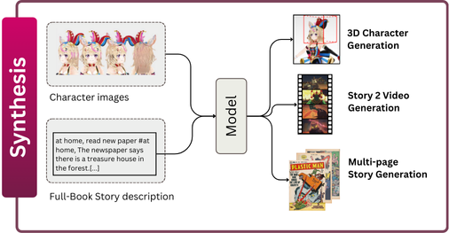
    

    - 

        
3D Generation from Images

        

        | **Year** | **Conference / Journal** | **Title** | **Authors** | **Links** |
        |:--------:|:--------------:|:----------------------------------------------------|:---------------------|:---------:|
        |   2023   |      ECCV      | AnimeCeleb: Large-Scale Animation CelebHeads Dataset for Head Reenactment | *Kim, Kangyeol et al.* | [📜 Paper](http://arxiv.org/abs/2111.07640), [👨‍💻 Code](https://github.com/kangyeolk/AnimeCeleb) |
        |   2023   |      IJCAI      | Collaborative Neural Rendering Using Anime Character Sheets | *Lin, Zuzeng et al.* | [📜 Paper](http://arxiv.org/abs/2207.05378), [👨‍💻 Code](https://github.com/megvii-research/IJCAI2023-CoNR) |
        |   2023   |      CVPR      | PAniC-3D: Stylized Single-view 3D Reconstruction from Portraits of Anime Characters | *Chen, Shuhong et al.* | [📜 Paper](https://ieeexplore.ieee.org/document/10204514/) |
        |   2023   |      Arxiv      | Sketch-A-Shape: Zero-Shot Sketch-to-3D Shape Generation | *Sanghi, Aditya et al.* | [📜 Paper](https://arxiv.org/abs/2307.03869) |
        |   2021   |      N/A      | Talking Head Anime from a Single Image 2: More Expressive | *Khungurn, Pramook et al.* | [👨‍💻 Code](https://github.com/pkhungurn/talking-head-anime-2-demo) |
        |   2020   |      ICLR      | U-GAT-IT: Unsupervised Generative Attentional Networks with Adaptive Layer-Instance Normalization for Image-to-Image Translation | *Kim, Junho et al.* | [📜 Paper](http://arxiv.org/abs/1907.10830), [👨‍💻 Code](https://github.com/Lornatang/UGATIT-PyTorch) |
        |   2017   |      3DV      | 3D Shape Reconstruction from Sketches via Multi-view Convolutional Networks | *Lun, Zhaoliang et al.* | [📜 Paper](https://ieeexplore.ieee.org/document/8374559/) |

    

    - 

        
Video generation

        

        | **Year** | **Conference / Journal** | **Title** | **Authors** | **Links** |
        |:--------:|:--------------:|:----------------------------------------------------|:---------------------|:---------:|
        |   2023   |      Arxiv      | DreamVideo: High-Fidelity Image-to-Video Generation with Image Retention and Text Guidance | *Wang, Cong et al.* | [📜 Paper](http://arxiv.org/abs/2312.03018), [👨‍💻 Code](https://github.com/anonymous0769/DreamVideo) |
        |   2023  |      Arxiv      | Photorealistic Video Generation with Diffusion Models | *Gupta, Agrim et al.* | [📜 Paper](http://arxiv.org/abs/2312.06662) |
        |   2023   |      Arxiv      | Motion-Conditioned Image Animation for Video Editing | *Yan, Wilson et al.* | [📜 Paper](http://arxiv.org/abs/2311.18827), [👨‍💻 Code](https://facebookresearch.github.io/MoCA) |
        |   2021   |      ICDAR      | C2VNet: A Deep Learning Framework Towards Comic Strip to Audio-Visual Scene Synthesis | *Gupta, Vaibhavi et al.* | [📜 Paper](https://link.springer.com/chapter/10.1007/978-3-030-86331-9_11), [👨‍💻 Code](https://github.com/gesstalt/IMCDB) |
        |   2016   |      TOMM      | Dynamic Manga: Animating Still Manga via Camera Movement | *Cao, Ying et al.* | [📜 Paper](https://ieeexplore.ieee.org/document/7567524) |
    

    - 

        
Narrative-based complex scene generation

        

        | **Year** | **Conference / Journal** | **Title** | **Authors** | **Links** |
        |:--------:|:--------------:|:----------------------------------------------------|:---------------------|:---------:|
        |   2024   |      WACV      | Synthesizing Coherent Story with Auto-Regressive Latent Diffusion Models | *Pan, Xichen et al.* | [📜 Paper](http://arxiv.org/abs/2211.10950), [👨‍💻 Code](https://github.com/xichenpan/ARLDM) |
        |   2023   |      CVPR      | Make-A-Story: Visual Memory Conditioned Consistent Story Generation | *Rahman, Tanzila et al.* | [📜 Paper](https://ieeexplore.ieee.org/document/10205339/) |
        |   2023   |     NeurIPS Workshop      | Personalized Comic Story Generation | *Peng, Wenxuan et al.* | [📜 Paper](https://neurips.cc/virtual/2023/81378) |
        |   2022   |      ECCV     | StoryDALL-E: Adapting Pretrained Text-to-Image Transformers for Story Continuation | *Maharana, Adyasha et al.* | [📜 Paper](http://arxiv.org/abs/2209.06192), [👨‍💻 Code](https://github.com/adymaharana/storydalle) |
        |   2022   |      EMNLP      | Character-Centric Story Visualization via Visual Planning and Token Alignment | *Chen, Hong et al.* | [📜 Paper](http://arxiv.org/abs/2210.08465), [👨‍💻 Code](https://github.com/PlusLabNLP/VP-CSV) |
        |   2021   |      NAACL      | Improving Generation and Evaluation of Visual Stories via Semantic Consistency | *Maharana, Adyasha et al.* | [📜 Paper](http://arxiv.org/abs/2105.10026), [👨‍💻 Code](https://github.com/adymaharana/StoryViz) |
        |   2018   |      CoRR      | StoryGAN: A Sequential Conditional GAN for Story Visualization | *Yitong Li et al.* | [📜 Paper](http://arxiv.org/abs/1812.02784) |
    

### **Datasets & Benchmarks 📂📎**
  - 

      
Datasets

      
      ### Overview of Comic/Manga Datasets and Tasks

      This table provides an overview of Comic/Manga datasets and tasks, including information on their availability, published year, source, and properties such as languages, number of comic/manga books, and pages. The rows are repeated according to the supported tasks. Accessibility is indicated with ⚠️ for no longer existing datasets, ❌ indicates existing but not accessible, and ✅ means existing and accessible. The link [proj] directs to the project websites, while [data] directs to dataset websites. For CoMix, *mix* means that it inherits from a mixture of four datasets.

      | **Task**              | **Name**                                                                                              | **Year** | **Access.** | **Language**       | **Origin** | **# books** | **# pages** |
      |-----------------------|-------------------------------------------------------------------------------------------------------|----------|-------------|--------------------|------------|-------------|-------------|
      | **Image Classification** | **Sequencity** \[[proj](http://www.manga109.org/en/download.html)\]                                    | 2017     | ⚠️          | EN, JP             | -          | -           | 140000      |
      |                       | **BAM!** \[[proj](http://www.manga109.org/en/download.html)\]                                          | 2017     | ⚠️          | -                  | -          | -           | 2500000     |
      |                       | **Manga109** \[[proj](http://www.manga109.org/en/download.html)\]\[[data](http://www.manga109.org/en/download.html)\] | 2018     | ✅          | JP                 | 1970-2010  | 109         | 21142       |
      |                       | **EmoRecCom** \[[proj](https://sites.google.com/view/emotion-recognition-for-comics)\]\[[data](https://competitions.codalab.org/competitions/30954#participate-get_data)\] | 2021     | ✅          | EN                 | 1938-1954  | -           | -           |
      | **Object Detection**  | **Fahad18** \[[proj](http://www.cat.uab.cat/Research/object-detection/)\]                               | 2012     | ❌          | -                  | -          | -           | 586         |
      |                       | **eBDtheque** \[[proj](https://ebdtheque.univ-lr.fr/)\]\[[data](https://ebdtheque.univ-lr.fr/registration/)\] | 2013     | ✅          | EN, FR, JP         | 1905-2012  | 25          | 100         |
      |                       | **sun70** \[[proj](http://www.manga109.org/en/download.html)\]                                         | 2013     | ❌          | FR                 | -          | 6           | 60          |
      |                       | **COMICS** \[[proj](https://github.com/miyyer/comics)\]\[[data](https://obj.umiacs.umd.edu/comics/index.html)\] | 2017     | ✅          | EN                 | 1938-1954  | 3948        | 198657      |
      |                       | **BAM!** \[[proj](http://www.manga109.org/en/download.html)\]                                          | 2017     | ⚠️          | -                  | -          | -           | 2500000     |
      |                       | **JC2463** \[[proj](http://www.manga109.org/en/download.html)\]                                        | 2017     | ❌          | JP                 | -          | 14          | 2463        |
      |                       | **AEC912** \[[proj](http://www.manga109.org/en/download.html)\]                                        | 2017     | ❌          | EN, FR             | -          | -           | 912         |
      |                       | **GCN** \[[proj](https://groups.uni-paderborn.de/graphic-literature/gncorpus/corpus.php)\]\[[data](https://groups.uni-paderborn.de/graphic-literature/gncorpus/download.php)\] | 2017     | ❌          | EN, JP             | 1978-2013  | 253         | 38000       |
      |                       | **Sequencity612** \[[proj](http://www.manga109.org/en/download.html)\]                                 | 2017     | ⚠️          | EN, JP             | -          | -           | 612         |
      |                       | **SSGCI** \[[proj](http://icpr2016-ssgci.univ-lr.fr/challenge/dataset-download/)\]\[[data](http://icpr2016-ssgci.univ-lr.fr/challenge/dataset-download/)\] | 2016     | ❌          | EN, FR, JP         | 1905-2012  | -           | 500         |
      |                       | **Comics3w** \[[proj](https://philokey.github.io/sren.html)\]                                          | 2017     | ❌          | JP, EN             | -          | 103         | 29845       |
      |                       | **comics2k** \[[proj](https://naoto0804.github.io/cross_domain_detection/)\]\[[data](https://github.com/naoto0804/cross-domain-detection/tree/master/datasets)\] | 2018     | ⚠️          | -                  | -          | -           | -           |
      |                       | **DCM772** \[[proj](https://paperswithcode.com/dataset/dcm)\]\[[data](https://git.univ-lr.fr/crigau02/dcm_dataset)\] | 2018     | ✅          | EN                 | 1938-1954  | 27          | 772         |
      |                       | **Manga109** \[[proj](http://www.manga109.org/en/download.html)\]\[[data](http://www.manga109.org/en/download.html)\] | 2018     | ✅          | JP                 | 1970-2010  | 109         | 21142       |
      |                       | **BCBId** \[[proj](https://sites.google.com/view/banglacomicbookdataset)\]\[[data](https://sites.google.com/view/banglacomicbookdataset/contacts?authuser=0)\] | 2022     | ✅          | BN                 | -          | 64          | 3327        |
      |                       | **COO** \[[proj](https://github.com/ku21fan/COO-Comic-Onomatopoeia)\]\[[data](https://github.com/manga109/public-annotations#comic-onomatopoeia-coo)\] | 2022     | ✅          | JP                 | 1970-2010  | 109         | 10602       |
      |                       | **COMICS-Text+** \[[proj](https://github.com/gsoykan/comics_text_plus)\]\[[data](https://github.com/gsoykan/comics_text_plus#getting-started)\] | 2022     | ✅          | EN                 | 1938-1954  | 3948        | 198657      |
      |                       | **PopManga** \[[proj](https://github.com/gsoykan/comics_text_plus)\]\[[data](https://github.com/gsoykan/comics_text_plus#getting-started)\] | 2024     | ✅          | EN                 | 1990-2020  | 25          | 1925        |
      |                       | **CoMix** \[[proj](https://github.com/emanuelevivoli/CoMix)\]\[[data](https://rrc.cvc.uab.es/?ch=31)\] | 2024     | ✅          | EN, FR             | 1938-2023  | 100         | 3800        |
      | **Re-Identification** | **Fahad18** \[[proj](http://www.cat.uab.cat/Research/object-detection/)\]                               | 2012     | ❌          | -                  | -          | -           | 586         |
      |                       | **Ho42**                                                                                               | 2013     | ❌          | -                  | -          | -           | 42          |
      |                       | **Manga109** \[[proj](http://www.manga109.org/en/download.html)\]\[[data](http://www.manga109.org/en/download.html)\] | 2018     | ✅          | JP                 | 1970-2010  | 109         | 21142       |
      |                       | **PopManga** \[[proj](https://github.com/gsoykan/comics_text_plus)\]\[[data](https://github.com/gsoykan/comics_text_plus#getting-started)\] | 2024     | ✅          | EN                 | 1990-2020  | 25          | 1925        |
      |                       | **CoMix** \[[proj](https://github.com/emanuelevivoli/CoMix)\]\[[data](https://rrc.cvc.uab.es/?ch=31)\] | 2024     | ✅          | EN, FR             | 1938-2023  | 100         | 3800        |
      | **Linking**           | **eBDtheque** \[[proj](https://ebdtheque.univ-lr.fr/)\]\[[data](https://ebdtheque.univ-lr.fr/registration/)\] | 2013     | ✅          | EN, FR, JP         | 1905-2012  | 25          | 100         |
      |                       | **sun70**                                                                                             | 2013     | ❌          | FR                 | -          | 6           | 60          |
      |                       | **GCN** \[[proj](https://groups.uni-paderborn.de/graphic-literature/gncorpus/corpus.php)\]\[[data](https://groups.uni-paderborn.de/graphic-literature/gncorpus/download.php)\] | 2017     | ❌          | EN, JP             | 1978-2013  | 253         | 38000       |
      |                       | **Manga109** \[[proj](http://www.manga109.org/en/download.html)\]\[[data](http://www.manga109.org/en/download.html)\] | 2018     | ✅          | JP                 | 1970-2010  | 109         | 21142       |
      |                       | **PopManga** \[[proj](https://github.com/gsoykan/comics_text_plus)\]\[[data](https://github.com/gsoykan/comics_text_plus#getting-started)\] | 2024     | ✅          | EN                 | 1990-2020  | 25          | 1925        |
      |                       | **CoMix** \[[proj](https://github.com/emanuelevivoli/CoMix)\]\[[data](https://rrc.cvc.uab.es/?ch=31)\] | 2024     | ✅          | EN, FR             | 1938-2023  | 100         | 3800        |
      | **Segmentation**      | **Sequencity4k** \[[proj](http://www.manga109.org/en/download.html)\]                                 | 2020     | ⚠️          | EN, FR, JP         | -          | -           | 4479        |
      | **Dialog Generation** | **PopManga** \[[proj](https://github.com/gsoykan/comics_text_plus)\]\[[data](https://github.com/gsoykan/comics_text_plus#getting-started)\] | 2024     | ✅          | EN                 | 1990-2020  | 25          | 1925        |
      |                       | **CoMix** \[[proj](https://github.com/emanuelevivoli/CoMix)\]\[[data](https://rrc.cvc.uab.es/?ch=31)\] | 2024     | ✅          | EN, FR             | 1938-2023  | 100         | 3800        |
      | **Unknown**           | **VLRC** \[[proj](https://dataverse.nl/)\]\[[data](https://dataverse.nl/dataset.xhtml?persistentId=doi:10.34894/LWMZ7G)\] | 2023     | ❌          | JP, FR, EN, 6+     | 1940-present | 376         | 7773        |

      
  

## Venues

  - 

      
Journals

      - **TPAMI**: IEEE Transactions on Pattern Analysis and Machine Intelligence
      - **TIP**: IEEE Transactions on Image Processing
      - **TOMM**: IEEE Transactions on Multimedia
      - **TVCG**: IEEE Transactions on Visualization and Computer Graphics
      - **TCSVT**: IEEE Transactions on Circuits and Systems for Video Technology
      - **THMS**: IEEE Transactions on Human-Machine Systems
      - **ACM-TG**: Transactions on Graphics
      - **ACM-TAC**: Transactions on Accessible Computing
      - **IJHCI:** International Journal on Human-Computer Interaction
      - **IJI**: The International Journal on the Image
      - **IJCG**: The Visual Computer: International Journal of Computer Graphics
      - **IJDAR**: International Journal on Document Analysis and Recognition
      - **MM-CCA**: Transaction on Multimedia Computing, Communication and Applications
    

  - 

    
Conferences

        
      - **NeurIPS**: Neural Information Processing Systems
      - **ICML**: International Conference on Machine Learning
      - **CVPR**: IEEE/CVF Conference on Computer Vision and Pattern Recognition
      - **ICCV**: IEEE/CVF International Conference of Computer Vision
      - **ECCV**: IEEE/CVF European Conference of Computer Vision
      - **WACV**: IEEE/CVF Winter Conference on Applications of Computer Vision
      - **SciVis**: IEEE Scientific Visualization Conference
      - **ICIP**: IEEE International Conference on Image Processing
      - **VCIP**: IEEE International Conference Visual Communication Image Process
      - **CSNT**: IEEE International Conference on Communication Systems and Network Technologies
      - **CAIDCD**: IEEE International Conference on Computer-Aided Industrial Design and Conceptual Design
      - **ACM**: Association for Computing Machinery
      - **ICDAR**: IAPR International Conference on Document Analysis and Recognition
      - **ICPR**: International Conference on Pattern Recognition
      - **ICIR**: International Conference on Intelligent Reality
      - **IIAI-AAI**: International Congress on Advanced Applied Informatics
      - **MMM**: Multimedia Modeling
      - **LREC**: International Conference on Language Resources and Evaluation
      - **MTA**: Multimedia Tools and Applications
      - **ICIT**: International Conference on Information Technology
      - **ICIAP**: International Conference on Image Analysis and Processing
      - **IJCNN**: International Joint Conference on Neural Networks
      - **ACPR**: IAPR Asian Conference on Pattern Recognition
      - **ICGC**: IEEE International Conference on Granular Computing
      - **CAVW**: Computer Animation and Virtual Worlds
      - **MM-TA**: Multimedia Tools and Applications
      - **DICTA**: International Conference on Digital Image Computing: Techniques and Applications
      - **UIST**: ACM Symposium on User Interface Software and Technology
      - **EMNLP**: ACM Conference on Empirical Methods in Natural Language Processing
      - **IIWAS**: International Conference on Information Integration and Web-based Applications and Services
      - **MDPI-AS**: MDPI Applied Science
      - **ICMLC**: International Conference on Machine Learning and Cybernetics
      - **LACLO**: Latin American Conference on Learning Technologies
      - **ACL**: Association for Computational Linguistics
      - **ICCC**: International Conference on Computational Creativity
      - **3DV**: International Conference on 3D Vision
    

  - 

    
Workshops

      - **MANPU**: IAPR International Workshop on Comics Analysis, Processing and Understanding
      - **DAS**: IAPR International Workshop on Document Analysis Systems
      - **IWAIT**: International Workshop on Advanced Image Technology
      - **ISPACS**: Symposium on Intelligent Signal Processing and Communication Systems
      - **SIGCSE**: ACM Technical Symposium on Computer Science Education
      - **ISM**: IEEE International Symposium in Multimedia

# Links

## 🔧 Tools & Repositories
- [CoMix](https://github.com/emanuelevivoli/CoMix) - Framework for managing and benchmarking comics datasets
- [ImageTrans](https://www.basiccat.org/imagetrans/) - Image translation for manga
- [Manga Image Translator](https://github.com/zyddnys/manga-image-translator) - Manga image translation
- [Comic Translate](https://github.com/ogkalu2/comic-translate) - Comic translation

# How to Contribute 🚀

You can contribute in two ways:
1. The easiest is to open an Issue (see an example in issue #1) and we can discuss if there are missing papers, wrong associations or links, or misspelled venues.
2. The second one is making a pull request with the implemented changes, following the steps:
   1. Fork this repository and clone it locally.
   2. Create a new branch for your changes: `git checkout -b feature-name`.
   3. Make your changes and commit them: `git commit -m 'Description of the changes'`.
   4. Push to your fork: `git push origin feature-name`.
   5. Open a pull request on the original repository by providing a description of your changes.

This project is in constant development, and we welcome contributions to include the latest research papers in the field or report issues 💥💥.

# Star History ⭐

# Acknowledge

Many thanks to my co-authors for taking the time to help me with the various refactoring of the survey.
Thanks to [Beppe Folder](https://github.com/giuseppecartella) for its [Awesome Human Visual Attention repo](https://github.com/aimagelab/awesome-human-visual-attention) that inspired the ✨**style**✨ of this repository.
